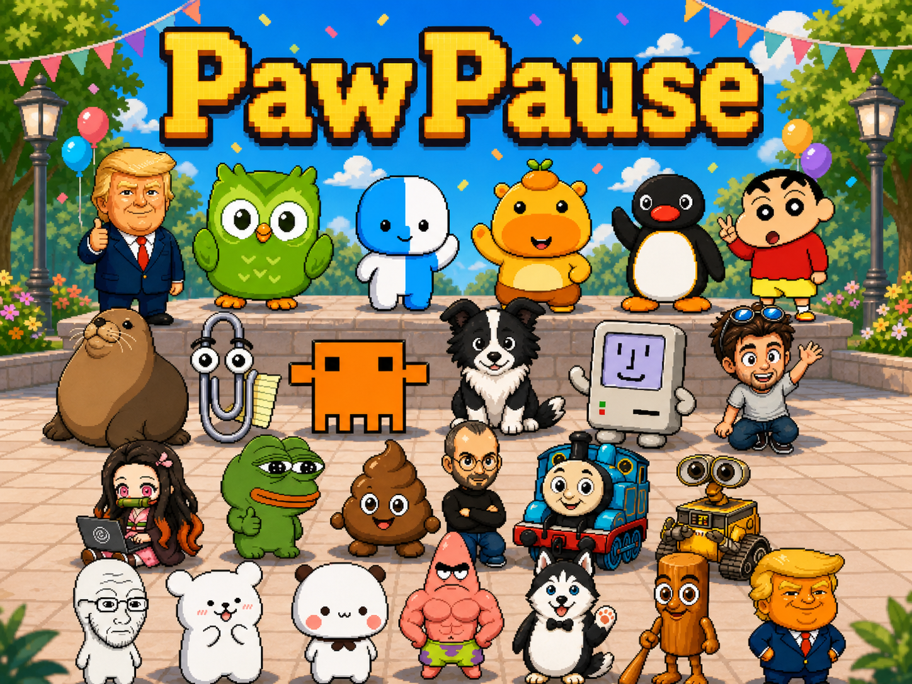

<p align="center">
  
</p>

<h1 align="center">PawPause</h1>

<p align="center">
  <a href="../../README.md">English</a> ·
  <a href="README.zh-CN.md">中文</a> ·
  <a href="README.ja.md">日本語</a> ·
  <a href="README.ko.md">한국어</a> ·
  <a href="README.fr.md">Français</a> ·
  <a href="README.de.md">Deutsch</a> ·
  <a href="README.ru.md">Русский</a> ·
  <a href="README.ar.md">العربية</a> ·
  <a href="README.es.md">Español</a>
</p>

PawPause は macOS / Windows 向けのピクセルデスクトップ相棒です。画面上に小さな相棒を常駐させ、休憩、水分補給、集中をやさしく促し、PetDex 形式のキャラクターをインポートできます。

ローカルファーストです：設定、統計、インポートした相棒、集中履歴はあなたのマシン上に保存されます。

## 機能

- 透明、最前面、ドラッグ可能なピクセル相棒
- 休憩リマインダーと任意の画面ブロック休憩
- 水分補給リマインダーと履歴統計
- カスタム毎日リマインダー：カウントダウンの事前表示時間と通知時の拡大率を設定可能
- macOS のアクティブウィンドウ検出による気晴らし通知
- Codex / Claude Code / OpenCode / DeepSeek TUI / Hermes のローカル完了通知
- `pet.json + spritesheet.webp/png` パッケージのインポート
- `~/.codex/pets` の PetDex キャラクターを自動読み込み
- 9 言語 UI とシステムのダークモード対応

## インストール

[Releases](https://github.com/angziii/PawPause/releases) からダウンロードしてください。

| ファイル | プラットフォーム |
| --- | --- |
| `PawPause-x.x.x-mac-arm64.dmg` | macOS Apple Silicon |
| `PawPause-x.x.x-mac-x64.dmg` | macOS Intel |
| `PawPause-x.x.x-win-x64.exe` | Windows 64-bit |

## Hermes（WSL）と PawPause（Windows）

Hermes を WSL で実行し、PawPause を Windows で実行する場合、Hermes のイベント出力先は Windows 側から読めるパスである必要があります。新しい Hermes hook は自動対応しますが、通知が出ない場合は WSL 側の plugin でパスを固定してください。

```bash
nano ~/.hermes/plugins/pawpause-agent-hook/__init__.py
```

`_output_file()` 全体を次の内容に置き換えます。

```python
def _output_file() -> Path:
    # WSL -> Windows PawPause fallback.
    return Path("/mnt/c/Users/Administrator/.local/share/pawpause/agent-events/hermes.jsonl")
```

Windows のユーザー名が `Administrator` でない場合は、その部分を実際のユーザー名に変更してください。その後 WSL で実行します。

```bash
mkdir -p /mnt/c/Users/Administrator/.local/share/pawpause/agent-events
```

最後に Hermes を再起動します。

## ソースから実行

```bash
git clone https://github.com/angziii/PawPause.git
cd PawPause
corepack enable
corepack pnpm install
corepack pnpm dev
```

リポジトリを小さく保つため、大きなキャラクター素材パックは含めていません。ローカルでインポートまたは PetDex からインストールしてください。
